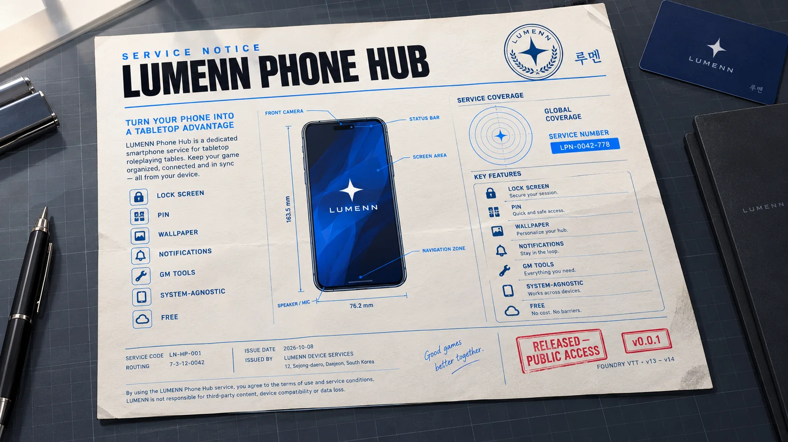

# Lumenn Phone Hub

[](https://github.com/SoftMissT/Lumenn-phone-hub/releases/latest)
[](https://foundryvtt.com)
[](LICENSE)
[](https://github.com/SoftMissT/Lumenn-phone-hub/releases)
[](https://github.com/SoftMissT/Lumenn-phone-hub/issues)

Um **celular diegético** para mesas de **Foundry VTT (v13–v14)**, totalmente **independente de sistema**. Seus jogadores ganham um smartphone dentro do jogo tela de bloqueio, PIN, wallpaper, notificações e relógio do mundo. O GM ganha uma central para enviar mensagens, abrir o aparelho de qualquer personagem e redefinir dados.

Sem adaptadores por sistema. Sem backend. Sem dependências externas. Tudo vive no próprio mundo do Foundry.

---

## Status

**Fase 1 completa em código e publicada em `v0.0.1`.** QA em runtime ainda pendente.

|                |                                              |
| -------------- | -------------------------------------------- |
| **Versão**     | `0.0.1`                                      |
| **Foundry**    | mínimo `13.350`                              |
| **Sistemas**   | qualquer (system-agnostic)                   |
| **Permissões** | jogador usa o próprio celular · GM usa todos |
| **Licença**    | MIT                                          |

> [!IMPORTANT]
> Este é o primeiro release. Os apps de conteúdo (Mensagens, Banco, Notícias, Redes) **ainda não existem** veja [O que ainda não existe](#o-que-ainda-não-existe) antes de contar com eles.

> [!WARNING]
> O módulo declara `verified: 14.356` no manifesto, mas isso **ainda não foi validado em runtime** por nenhum teste ao vivo. Trate o v14 como esperado-funcional, não como confirmado.

---

## Instalação

### Pelo Foundry (recomendado)

1. Abra o Foundry e vá em **Configurações → Módulos → Instalar Módulo**.
2. Cole esta URL no campo **URL do Manifesto**:

```
https://github.com/SoftMissT/Lumenn-phone-hub/releases/latest/download/module.json
```

3. Clique em **Instalar**.
4. Ative **Lumenn Phone Hub** em _Configurações → Gerenciar Módulos_.

### Manual

1. Baixe o `lumenn-phone-hub.zip` na [página de releases](https://github.com/SoftMissT/Lumenn-phone-hub/releases/latest).
2. Extraia para `Data/modules/`, de forma que o caminho final seja `Data/modules/lumenn-phone-hub/module.json`.
3. Reinicie o Foundry e ative o módulo.

**Requisitos:** Foundry VTT **13.350** ou superior. O módulo é system-agnostic não exige nenhum sistema específico.

---

## Como usar

### Jogador

Clique no botão **Celular (Lumenn)** na barra de controles de cena (coluna da esquerda). O telefone abre para o personagem que você está controlando.

Se nenhum personagem estiver atribuído a você, o módulo avisa em vez de abrir uma tela vazia.

### GM

Como GM, o botão abre a **Central do GM**, com:

- **Enviar notificação** para um personagem, vários, ou todos os elegíveis;
- **Abrir o celular** de qualquer personagem, em Modo GM;
- **Redefinir PIN** de um personagem;
- **Redefinir wallpaper** de um personagem.

No **Modo GM** o telefone mostra uma faixa de identificação (`Modo GM {nome}`) para deixar explícito que aquele não é o seu aparelho.

### Sem barra de controles

Se outro módulo conflitar com o grupo de controles, use a macro pronta em [`macros/open-lumenn-phone.js`](macros/open-lumenn-phone.js) ou a API pública.

---

## Recursos da Fase 1

### Phone Shell

Tela de bloqueio, home screen, dock, grade de apps, navegação interna, barra de status (sinal, Wi-Fi, bateria), notch genérico, indicador inferior e **temas claro e escuro**.

O Shell conhece apenas o **contrato de app**. Ele não conhece Mensagens, Banco ou qualquer app de conteúdo esses se registram pela API quando existirem.

### PIN e bloqueio

- PIN **opcional** de exatamente **6 dígitos**.
- Guardado como **hash + salt**, nunca em texto claro.
- **Throttling** e **lockout progressivo** contra tentativas repetidas.
- Política que rejeita PINs triviais.
- **Reset pelo GM** a qualquer momento.
- A interface de criação/troca/remoção fica em **Ajustes → Segurança**, dentro do próprio celular.

> [!NOTE]
> O PIN é um **lock de privacidade diegético** serve para dar privacidade entre jogadores na mesa. Ele **não** é autenticação forte, não criptografa dados e não é uma barreira contra o GM ou contra o DevTools do navegador.

### Wallpaper

Wallpaper **por personagem**, com validação de arquivo (tamanho, dimensões, tipo). O jogador escolhe do Foundry ou envia do próprio computador; o GM pode definir um wallpaper padrão do mundo e redefinir o de qualquer personagem.

### Notificações

- **Banner** na tela do celular, com **som** configurável.
- **Badge** de não lidas.
- **Lock screen notifications**.
- Estados **unread / read / dismissed**.
- **Persistência narrativa**: as notificações ficam salvas no mundo, com expiração padrão de 7 dias e limite de 200 por personagem.

### Relógio do mundo

Fuso IANA configurável, **ano narrativo** substituível e **rótulo de era** livre (ex.: `AC`, `Era Espacial`). O relógio acompanha a ficção da sua mesa em vez da data real.

### Central do GM

Envio de notificações em massa, inspeção e controle dos aparelhos, Modo GM e resets tudo em um só lugar, sem console.

### Acessibilidade

Navegação por teclado, foco visível, regiões `aria-live` para notificações, suporte a `prefers-reduced-motion`, `prefers-contrast` e `forced-colors`, além de um modo **Reduzir efeitos visuais** dentro de Ajustes.

---

## Para o GM: configurações do mundo

Em _Configurações → Configurar Definições → Lumenn Phone Hub_:

| Configuração         | O que faz                                                                          |
| -------------------- | ---------------------------------------------------------------------------------- |
| **Fuso horário**     | Fuso IANA do relógio (ex.: `America/Sao_Paulo`). Vazio usa o fuso de cada jogador. |
| **Ano narrativo**    | Substitui o ano real no celular. `0` mantém o ano real.                            |
| **Rótulo de era**    | Era exibida ao lado do ano (ex.: `AC`, `Era Espacial`).                            |
| **Wallpaper padrão** | Aplicado a todo celular sem escolha pessoal.                                       |
| **Log de depuração** | Logs detalhados no console do navegador.                                           |

Tema, sons e redução de efeitos são **por jogador**, ajustados dentro do celular em **Ajustes**.

---

## API pública e hooks

Todos os dados do módulo ficam em um `JournalEntry` interno e oculto os personagens não aparecem na sidebar de Diários.

```js
const api = game.modules.get("lumenn-phone-hub").api;

api.openPhone({ actorUuid: actor.uuid }); // abre o celular
api.closePhone(); // fecha
api.openPhoneAsGM(actorUuid); // GM abre o celular de outro (exige GM)

api.notifications.send({
  /* dados da notificação */
});
api.notifications.list(actorUuid);

api.apps.register(definition); // registra um app de conteúdo
api.apps.get(id);
api.apps.list(filter);
```

**Hooks disponíveis:**

`lumennPhoneReady` · `lumennNotificationCreated` · `lumennNotificationReceived` · `lumennAppRegistered` · `lumennPhoneOpened` · `lumennPhoneClosed`

---

## Desenvolvimento

O código é JavaScript modular, sem etapa de build. Os testes rodam no Node puro, direto sobre os mesmos arquivos que o Foundry carrega:

```bash
node --test
```

São 12 suítes cobrindo registro de apps, política e lockout de PIN, o fallback de KDF, validação, envelope de socket, fuso/relógio, validação de wallpaper, modelo e store de notificações, e áudio de digitação.

**Estrutura:**

```
scripts/
  compat/        camada de compatibilidade Foundry v13/v14
  core/          constantes, settings, logger, lifecycle, API pública
  apps/          App Registry e apps embutidos (Ajustes, Central do GM, Inspector)
  phone/         shell do telefone e controlador
  lock/          KDF do PIN (WebCrypto + fallback puro JS) e lockout
  persistence/   repository, journal store, schemas
  notifications/ modelo, store, banner, áudio e serviço
  wallpaper/     validação, storage e serviço
  socket/        envelope e runtime de socket
  time/          fuso horário e relógio do mundo
  validation/    validadores de texto, ids e URLs
lang/            en, pt-BR
macros/          macro de abertura via API
templates/       Handlebars
styles/          base + temas claro e escuro
tests/           suíte do Node
```

**Compatibilidade:** toda diferença entre v13 e v14 fica isolada em `scripts/compat/`. Se você for contribuir, evite chamar APIs do Foundry direto das telas passe pela camada de compatibilidade.

---

## O que ainda não existe

Estes itens estão **explicitamente fora da Fase 1** e não devem ser esperados neste release:

- chat de **Mensagens**, KakaoTalk, Instagram, feed social, posts e fotos sociais;
- **Banco** e transações financeiras;
- **Notícias**;
- Spotify e login OAuth;
- IA para NPCs;
- adaptadores por sistema e integração monetária de sistemas;
- criptografia ponta-a-ponta, autenticação forte por PIN, biometria;
- push notifications fora do Foundry;
- aplicativo móvel real.

A arquitetura já os acomoda: cada app se registra pela API pública e pode adicionar sua própria seção na Central do GM. Nenhum ícone vazio é exibido enquanto eles não existem.

---

## Licença

[MIT](LICENSE) © 2026 Nelson Antonio Silva Leme Gonçalves
